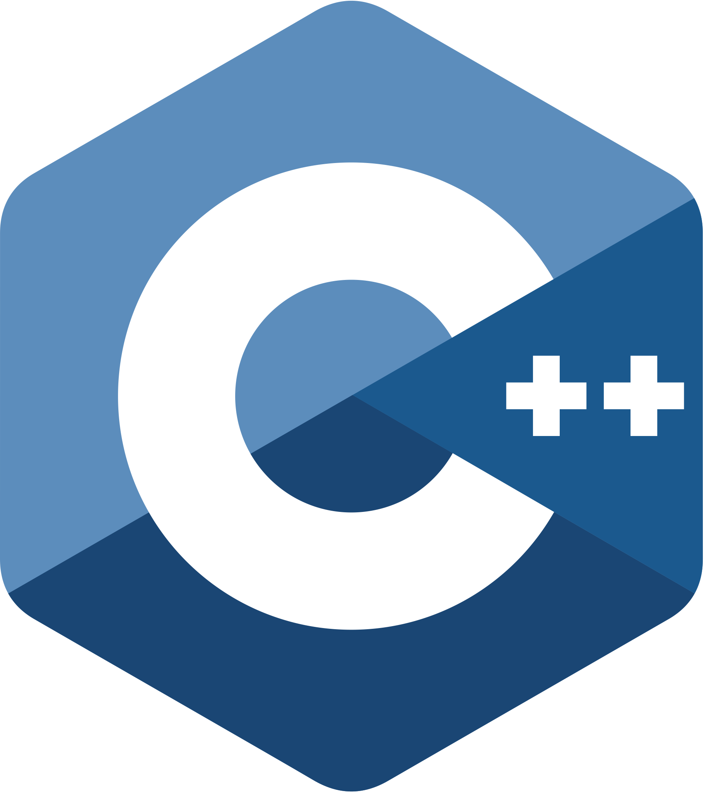

### Hey there🙋‍♂️, I'm Utkarsh
#### Full Stack Developer | Web3 Enthusiast

 

- 🔭 <b>I’m currently working on<b> Freelance Projects 
- 🌱 I’m currently learning Solidity, Microsoft Azure 
- 🤔 I’m looking for help with Linux 
- 📝 I'm making tutorials on [Xcoderse](https://www.youtube.com/channel/UCStJJmtgJnLoTKBRi9cOQSg)
- ⚡ Fun fact: Algorithm is a word used by Programmers when they do not want to explain what they did.  
 
<!--  -->
<!-- wi*quL3fcV -->
<!--  -->

<!--  -->

<!-- 

 -->
<h2 align="left" id="macropower-tech">Connect with me</h2>

> Go check out my handles and follow em'
 

 
 
 
<h2 align="left" id="macropower-tech">Technologies</h2>

> Development, Design, Hosting, Tools

<!-- <table>
   <tr>
      <td align="center" width="96">
         
          HTML
      </td>
      <td align="center" width="96">
         
          CSS
      </td>
      <td align="center" width="96">
         
          JavaScript
      </td>
      <td align="center" width="96">
         
          Bootstrap
      </td>
      <td align="center" width="96">
         
          Sass
      </td>
<td align="center" width="96">
         
          React
      </td>
   </tr>
   <tr>
      <td align="center" width="96">
         
          C
      </td>
      <td align="center" width="96">
         
          C++
      </td>
      <td align="center" width="96">
         
          Python
      </td>
      <td align="center" width="96">
         
          PHP
      </td>
      <td align="center" width="96"> 
         
          MySQL
      </td>
<td align="center" width="96"> 
         
          Solidity
      </td>
   </tr>
</table>
 -->
<!--  -->
<!--  -->
<!--  -->
<!-- ### Development, Design, Hosting, Tools -->

<!--  -->
   
<!--        -->

   

   
<!--  -->
   

    
